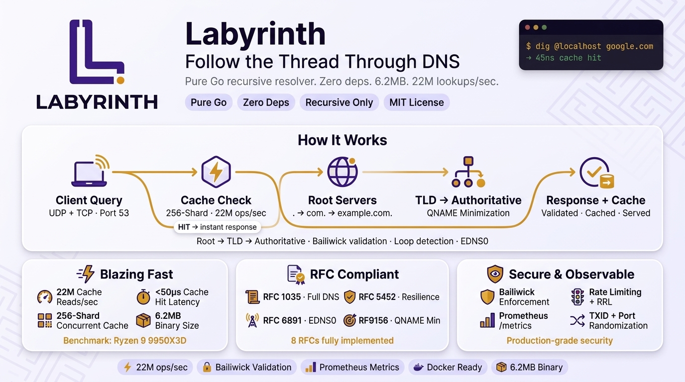

# Labyrinth DNS Resolver

**Pure Go Recursive DNS Resolver with Web Dashboard**

*"Follow the thread through the DNS labyrinth."*

<p align="center">
  
</p>

---

## Features

- **Single binary** — DNS resolver + web dashboard + auth, everything in one 6.8 MB executable
- **Web dashboard** — Real-time DNS monitoring, cache management, live query stream, dark/light theme
- **Zero-config start** — Interactive setup wizard on first run, sane defaults for everything
- **Recursive only** — Navigates root → TLD → authoritative, caches results
- **RFC compliant** — RFC 1035, 2308, 3596, 4033-4035, 6891, 8767, 9156
- **DNSSEC validation** — Full signature verification (RSA, ECDSA, ED25519), trust chain from root KSK
- **DNS blocklist** — Pi-hole style domain blocking with hosts/domain/AdBlock Plus list formats
- **Secure** — JWT auth, bcrypt passwords, bailiwick enforcement, rate limiting, ACL
- **Observable** — Prometheus metrics, Zabbix agent, structured logging, WebSocket query stream
- **Self-updating** — Automatic version check + one-click update from web dashboard
- **Fast** — Sharded cache, >22M cache reads/sec, <50µs cache hit latency, request coalescing

## Quick Install

```bash
# One-line install (Linux/macOS, as root)
curl -sSL https://raw.githubusercontent.com/labyrinthdns/labyrinth/main/install.sh | bash

# Then open the dashboard to complete setup:
# http://127.0.0.1:9153
```

The installer downloads the latest release, installs the binary, creates a default config, sets up a systemd service, and starts Labyrinth automatically.

### Install Options

```bash
# Install without systemd service
curl -sSL .../install.sh | bash -s -- --no-service

# Install specific version
curl -sSL .../install.sh | bash -s -- --version v0.3.0

# Uninstall
curl -sSL .../uninstall.sh | bash
```

### Other Installation Methods

```bash
# From source
git clone https://github.com/labyrinthdns/labyrinth.git
cd labyrinth
cd web/ui && npm ci && npm run build && cd ../..
go build -ldflags="-s -w" -o labyrinth .

# Docker (GHCR)
docker pull ghcr.io/labyrinthdns/labyrinth:latest
docker run -p 53:53/udp -p 53:53/tcp -p 9153:9153 ghcr.io/labyrinthdns/labyrinth:latest

# Docker Compose
docker-compose up -d
```

## Web Dashboard

Labyrinth includes a built-in web dashboard accessible at `http://127.0.0.1:9153`.

### Setup Wizard

On first run (no config file), the dashboard shows an interactive setup wizard:

1. **Welcome** — Server info and version
2. **Admin Account** — Set username and password
3. **Network** — Configure listen address and dashboard address
4. **DNS Settings** — Cache size, QNAME minimization
5. **Review & Apply** — Writes `labyrinth.yaml` automatically

### Dashboard Pages

| Page | Description |
|------|-------------|
| **Dashboard** | Real-time stats: QPS chart, cache hit ratio, response code distribution, DNSSEC status, blocked queries |
| **Queries** | Live DNS query stream via WebSocket — filterable, pausable, DNSSEC badges, blocked indicators |
| **Cache** | Cache stats, lookup tool, flush, delete individual entries, negative cache view |
| **Blocklist** | List management, quick block/unblock, domain check, source stats |
| **Config** | Running configuration viewer, password change |

### Authentication

- JWT-based (HMAC-SHA256, 24h tokens)
- Passwords stored as bcrypt hashes
- Generate a password hash: `labyrinth hash <password>`

## Configuration

Labyrinth works with zero configuration. For customization, create `labyrinth.yaml`:

```yaml
server:
  listen_addr: "0.0.0.0:53"
  metrics_addr: "127.0.0.1:9153"
  tcp_timeout: 10s

resolver:
  max_depth: 30
  qname_minimization: true
  prefer_ipv4: true
  dnssec_enabled: true

cache:
  max_entries: 100000
  min_ttl: 5
  max_ttl: 86400
  serve_stale: false

security:
  rate_limit:
    enabled: true
    rate: 50
    burst: 100
  rrl:
    enabled: true
    responses_per_second: 5
    slip_ratio: 2

logging:
  level: info
  format: json

web:
  enabled: true
  addr: "127.0.0.1:9153"
  auto_update: true
  update_check_interval: 24h
  auth:
    username: "admin"
    password_hash: "$2a$10$..."  # labyrinth hash <password>

blocklist:
  enabled: true
  # lists: "https://example.com/hosts|hosts"
  refresh_interval: 24h
  blocking_mode: nxdomain  # nxdomain, null_ip, custom_ip

# access_control:
#   allow: 127.0.0.0/8, 10.0.0.0/8, 192.168.0.0/16
#   deny:

# zabbix:
#   enabled: true
#   addr: "127.0.0.1:10050"

# daemon:
#   enabled: false
#   pid_file: "/var/run/labyrinth.pid"
```

Configuration priority: CLI flags > environment variables > YAML file > defaults.

### CLI

```
labyrinth [flags] [command]

Commands:
  check               Validate config file and exit
  version             Print version info
  hash <password>     Generate bcrypt password hash
  daemon start|stop|status   Manage background daemon

Flags:
  -listen    string   Listen address (default ":53")
  -web       string   Web dashboard address (overrides config)
  -metrics   string   Metrics HTTP address
  -config    string   Config file path (default "labyrinth.yaml")
  -log-level string   Log level: debug|info|warn|error
  -log-format string  Log format: json|text
  -cache-size int     Max cache entries
  -daemon            Run as background daemon
  -version           Print version and exit
```

### Environment Variables

```
LABYRINTH_SERVER_LISTEN_ADDR=:53
LABYRINTH_SERVER_METRICS_ADDR=127.0.0.1:9153
LABYRINTH_LOGGING_LEVEL=debug
LABYRINTH_CACHE_MAX_ENTRIES=200000
LABYRINTH_RESOLVER_MAX_DEPTH=30
```

## REST API

All endpoints (except auth/setup/health) require JWT authentication via `Authorization: Bearer <token>` header.

| Method | Path | Description |
|--------|------|-------------|
| POST | `/api/auth/login` | Login, returns JWT token |
| GET | `/api/auth/me` | Current user info |
| GET | `/api/stats` | Real-time statistics |
| GET | `/api/stats/timeseries?window=5m` | Time-bucketed stats for charts |
| WS | `/api/queries/stream` | Live DNS query WebSocket stream |
| GET | `/api/queries/recent?limit=50` | Recent queries |
| GET | `/api/cache/stats` | Cache statistics |
| GET | `/api/cache/lookup?name=X&type=A` | Cache entry lookup |
| POST | `/api/cache/flush` | Flush entire cache |
| DELETE | `/api/cache/entry?name=X&type=A` | Delete cache entry |
| GET | `/api/config` | Running config (passwords redacted) |
| POST | `/api/auth/change-password` | Change admin password |
| GET | `/api/blocklist/stats` | Blocklist statistics |
| GET | `/api/blocklist/lists` | Configured blocklist sources |
| POST | `/api/blocklist/refresh` | Refresh all blocklists |
| POST | `/api/blocklist/block` | Quick-block a domain |
| POST | `/api/blocklist/unblock` | Unblock a domain |
| GET | `/api/blocklist/check?domain=X` | Check if domain is blocked |
| GET | `/api/system/health` | Health check |
| GET | `/api/system/version` | Version info |
| GET | `/api/system/update/check` | Check for updates |
| POST | `/api/system/update/apply` | Apply available update |
| GET | `/api/setup/status` | Check if setup wizard needed |
| POST | `/api/setup/complete` | Complete setup wizard |
| GET | `/api/zabbix/items` | Zabbix metric key discovery |
| GET | `/api/zabbix/item?key=X` | Single Zabbix metric value |
| GET | `/metrics` | Prometheus metrics |

## Monitoring

### Prometheus

Scrape `http://labyrinth:9153/metrics` — exposes counters, histograms, gauges:

```
labyrinth_queries_total{type="A"} 28041
labyrinth_cache_hits_total 18294
labyrinth_cache_misses_total 9747
labyrinth_query_duration_seconds_bucket{le="0.001"} 15000
labyrinth_uptime_seconds 86400
```

### Zabbix

Two integration modes:

**HTTP Agent** (recommended) — Configure Zabbix items to poll:
```
http://labyrinth:9153/api/zabbix/item?key=labyrinth.cache.hit_ratio
```

**Native Agent** — Enable `zabbix.addr` in config for native Zabbix agent protocol on TCP port 10050.

Available keys: `labyrinth.queries.total`, `labyrinth.cache.hits`, `labyrinth.cache.misses`, `labyrinth.cache.hit_ratio`, `labyrinth.cache.entries`, `labyrinth.upstream.queries`, `labyrinth.upstream.errors`, `labyrinth.uptime`, `labyrinth.goroutines`

### Health Checks

- `GET /api/system/health` — Returns 200 with JSON when healthy
- `GET /api/system/version` — Returns version, build time, Go version

## Architecture

```
                    ┌──────────────────────────────────────┐
                    │           Labyrinth Binary            │
                    │                                      │
  DNS Clients ─────▶│  UDP/TCP :53  ──▶ Recursive Resolver │
                    │                   ├─ Root Hints       │
                    │                   ├─ QNAME Min        │
                    │                   ├─ DNSSEC Validation│
                    │                   ├─ Blocklist Filter │
                    │                   ├─ Cache (256-shard)│
                    │                   └─ Bailiwick/RRL    │
                    │                                      │
  Web Browser ─────▶│  HTTP :9153 ──▶ Web Dashboard        │
                    │                  ├─ React SPA         │
                    │                  ├─ REST API          │
                    │                  ├─ WebSocket Stream  │
                    │                  └─ JWT Auth          │
                    │                                      │
  Zabbix Server ───▶│  TCP :10050 ──▶ Zabbix Agent        │
                    │                                      │
  Prometheus ──────▶│  /metrics   ──▶ Prometheus Exporter  │
                    └──────────────────────────────────────┘
```

## Signals (Linux/macOS)

| Signal | Action |
|--------|--------|
| SIGINT/SIGTERM | Graceful shutdown |
| SIGUSR1 | Flush cache |
| SIGUSR2 | Dump cache stats to log |
| SIGHUP | Config reload notification |

## Performance

Benchmarked on AMD Ryzen 9 9950X3D:

| Operation | ops/sec | Latency |
|-----------|---------|---------|
| Cache Get | 22M | 45 ns |
| Cache Set | 19M | 53 ns |
| Wire Unpack | 4.4M | 225 ns |
| Wire Pack | 2.6M | 391 ns |
| Name Decode | 22.6M | 44 ns |
| FNV-1a Hash | 331M | 3 ns |
| Full Resolve (cached) | 700K | 1.4 µs |

Binary size: **6.8 MB** (stripped, with embedded web dashboard)

## RFC Compliance

| RFC | Title | Coverage |
|-----|-------|----------|
| 1035 | Domain Names | Full |
| 2181 | DNS Clarifications | Full |
| 2308 | Negative Caching | Full |
| 3596 | DNS IPv6 (AAAA) | Full |
| 4033-4035 | DNSSEC | Full |
| 5452 | DNS Resilience | Full |
| 6891 | EDNS0 | Full |
| 8767 | Serving Stale Data | Optional |
| 9156 | QNAME Minimization | Full |

## Development

```bash
# Prerequisites: Go 1.23+, Node.js 20+

# Build frontend
cd web/ui && npm ci && npm run build && cd ../..

# Build binary
make build

# Run tests (840+ tests, 98-100% coverage)
make test

# Run benchmarks
make bench

# Run fuzz tests
make fuzz

# Lint
make lint

# Cross-compile
make cross

# Docker build
make docker
```

## Project Structure

```
labyrinth/
├── main.go                 # Entry point, CLI, signal handling
├── dns/                    # Wire protocol, name compression, all RR types
├── resolver/               # Recursive resolution, QNAME min, delegation
├── dnssec/                 # DNSSEC validation, trust chain, RSA/ECDSA/ED25519
├── blocklist/              # Domain blocking, hosts/domain/ABP parsers
├── cache/                  # 256-shard concurrent cache, TTL decay, serve-stale
├── security/               # Bailiwick, rate limit, RRL, ACL
├── server/                 # UDP/TCP DNS servers, request handler
├── config/                 # YAML parser, env vars, validation
├── metrics/                # Prometheus metrics, atomic counters
├── log/                    # Structured logging (slog)
├── web/                    # Web dashboard backend
│   ├── server.go           # HTTP server, SPA serving, route registration
│   ├── auth.go             # JWT auth, bcrypt, login handler
│   ├── querylog.go         # Ring buffer for live query stream
│   ├── timeseries.go       # Rolling time-bucketed aggregator
│   ├── api_*.go            # REST API handlers
│   ├── embed.go            # go:embed for React SPA
│   └── ui/                 # React 19 + Tailwind 4.1 frontend
│       └── src/
│           ├── pages/      # Login, Setup, Dashboard, Queries, Cache, Config
│           ├── components/ # Layout, sidebar, charts
│           └── hooks/      # useAuth, useTheme, useWebSocket
├── daemon/                 # Daemonization (Unix/Windows)
├── install.sh              # One-line installer
├── uninstall.sh            # Uninstaller
├── Dockerfile              # Multi-stage Docker build
├── docker-compose.yml      # Docker Compose config
├── Makefile                # Build targets
├── labyrinth.service       # systemd service file
├── labyrinth.1             # Man page
└── labyrinth.yaml          # Example configuration
```

## License

MIT
